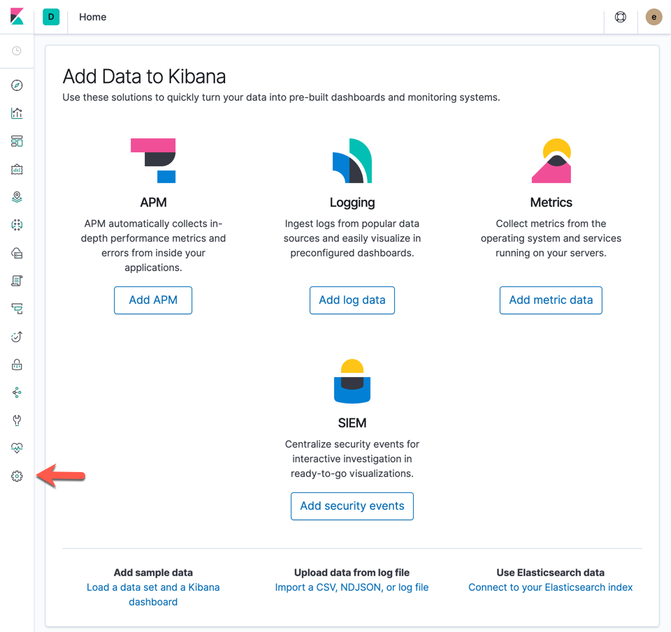
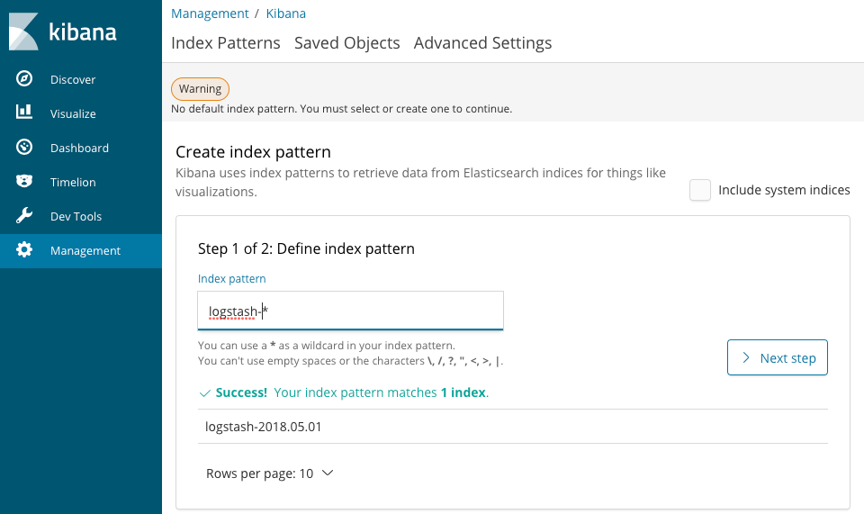
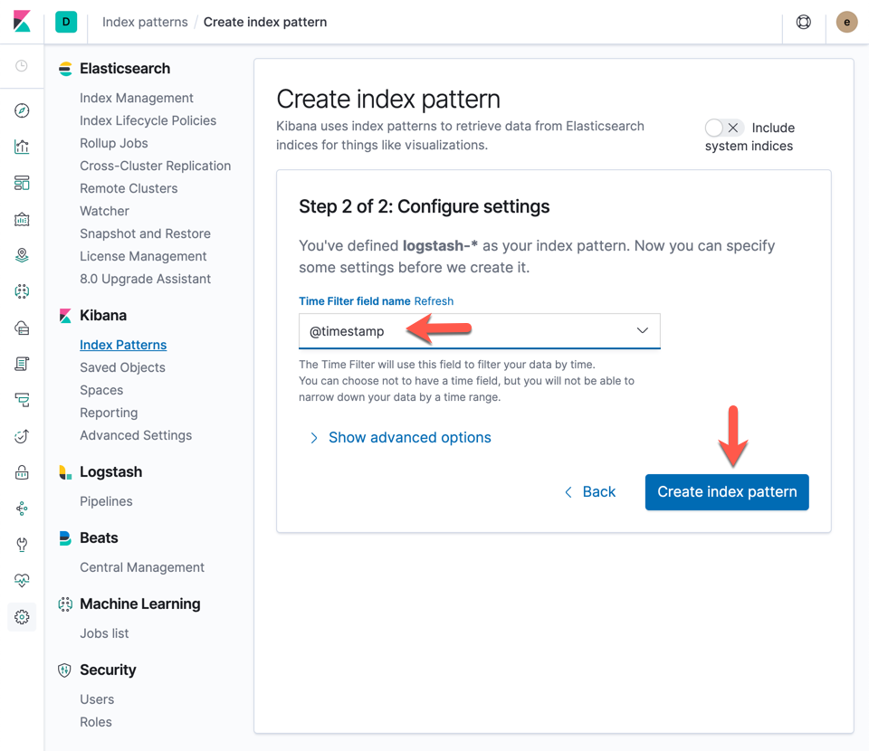
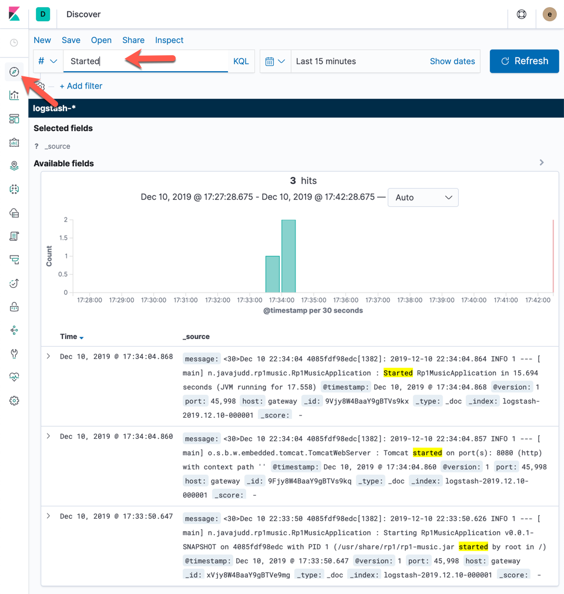

# Logs

Stream logs to a log service such as Elastic Stack (ELK Stack).

1. Clone Docker Compose repo for Elastic Stack.
```
git clone https://github.com/deviantony/docker-elk.git
cd docker-elk
docker-compose up -d
```

2. Test Kibana container is running by going to [http://localhost:5601](http://localhost:5601)

user: elastic
password: changeme

3. Rerun rp1-music container with log collection enabled.
```
docker run --name rp1-music -p 8080:8080 --network rp1-network -e SPRING_DATASOURCE_URL=jdbc:mysql://rp1-music-db:3306/rp1 -e SPRING_DATASOURCE_USERNAME=rp1 -e SPRING_DATASOURCE_PASSWORD=rp1+1 -e SPRING_OUTPUT_ANSI_ENABLED=NEVER --log-driver=syslog --log-opt syslog-address=tcp://:5000 --log-opt syslog-facility=daemon -it --rm javajudd/rp1-music:0.0.1-SNAPSHOT
```

4. In Kibana, configure index by going to [Management](http://localhost:5601/app/kibana#/management?_g=()).


5. In the Index pattern, press the Create index pattern button, enter logstash-* and press Next step button.


6. In the Time Filter field name, select @timestamp and press Create index pattern button.


7. Now you are ready to use the Discover to search for log related entries.
